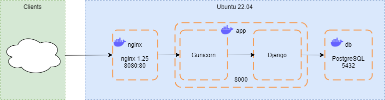

# PyEditorial Development Environment Setup
## About
This repository provides scripts to automate the setup of a development environment (Ubuntu 22.04 LTS) for PyEditorial, an open-source Python/Django CMS, using Docker containers.


## Development Environment Setup

To start preparing the development environment, the following commands need to be executed first.
> To avoid encountering any errors, you need to have root privileges.

1. Create a file setup.sh
   `touch setup.sh`
2. Make the file executable
   `chmod +x setup.sh`
3. Open the file by using any text editor
   `vim setup.sh`
4. Copy the following commands and paste them in **setup.sh**, then save and exit.
   ```
   #!/bin/bash

   # Add Docker's official GPG key:
   sudo apt-get update
   sudo apt-get install ca-certificates curl
   sudo install -m 0755 -d /etc/apt/keyrings
   sudo curl -fsSL https://download.docker.com/linux/ubuntu/gpg -o /etc/apt/keyrings/docker.asc
   sudo chmod a+r /etc/apt/keyrings/docker.asc

   # Add the repository to Apt sources:
   echo \
     "deb [arch=$(dpkg --print-architecture) signed-by=/etc/apt/keyrings/docker.asc] https://download.docker.com/linux/ubuntu \
     $(. /etc/os-release && echo "$VERSION_CODENAME") stable" | \
     sudo tee /etc/apt/sources.list.d/docker.list > /dev/null
   sudo apt-get install docker-ce docker-ce-cli containerd.io docker-buildx-plugin docker-compose-plugin -y
   git clone https://github.com/esrnru/devopsproject.git
   cd devopsproject
   sudo docker compose up -d --build
   ```
5. Execute the file `./setup.sh` or `bash setup.sh`

After these steps, all required dependencies will be installed and containers will be up and running.
